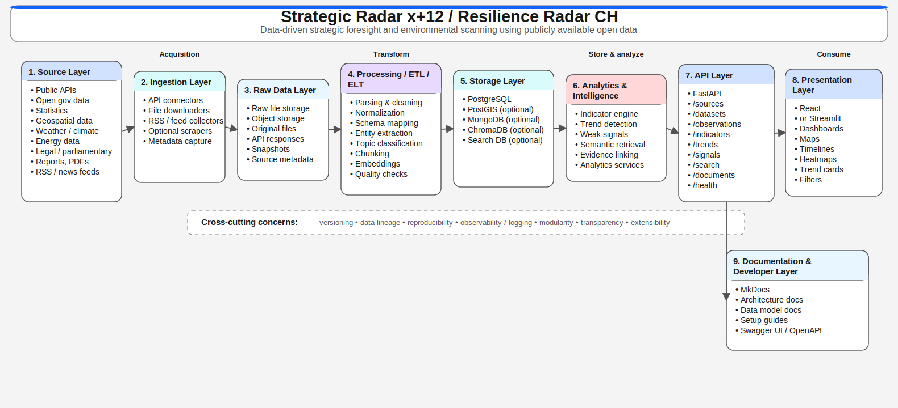

# Architecture

## Vision cible

Le challenge se prête à une architecture modulaire en couches. Elle sépare clairement la connexion aux sources, le traitement, le stockage, l’analyse, la mise à disposition et la documentation. Cela améliore la traçabilité, facilite le remplacement de composants et soutient la poursuite du développement après le hackathon.

## Architecture en couches en bref

| Couche | Rôle | Résultats typiques |
| --- | --- | --- |
| Source Layer | connecter des sources de données, documents et services publics | données brutes, métadonnées, références de source |
| Ingestion Layer | récupération, téléchargement et capture technique | réponses API, fichiers, snapshots |
| Raw Data Layer | stocker les artefacts source sans modification | originaux versionnés et journaux de récupération |
| Processing / ETL / ELT Layer | parsing, nettoyage, normalisation et mapping | datasets harmonisés et caractéristiques dérivées |
| Storage Layer | stockage structuré pour analyse et réutilisation | tables relationnelles, géodonnées, stores documentaires ou vectoriels optionnels |
| Analytics & Intelligence Layer | indicateurs, trend cards, weak signals et logique d’évidence | métriques calculées, signaux, évaluations |
| API Layer | mise à disposition standardisée pour frontend ou autres consommateurs | endpoints REST, OpenAPI, Swagger UI |
| Presentation Layer | tableau de bord, web app et visualisation | cartes, timelines, indicateurs, filtres |
| Documentation Layer | traçabilité technique et analytique | inventaire des sources, architecture, reproductibilité |

## Principes d’architecture

- **Modularité :** chaque couche doit rester remplaçable et testable séparément
- **Transparence des sources :** chaque résultat doit rester relié à des sources concrètes
- **Versionnement :** données brutes, logique de transformation et indicateurs doivent être versionnés de manière traçable
- **Reproductibilité :** documentation, schéma et logique d’accès doivent rester réutilisables après le hackathon
- **Noyau réduit :** privilégier quelques composants fiables plutôt qu’un stack large mais fragile

## Orientations technologiques

| Domaine | Recommandation |
| --- | --- |
| Base SQL | **PostgreSQL** comme base relationnelle privilégiée |
| Géodonnées | **PostGIS** en option pour l’analyse spatiale |
| Stockage documentaire ou NoSQL | **MongoDB** en option |
| Vector store | **ChromaDB** en option |
| Recherche / texte intégral | base de recherche optionnelle pour mots-clés ou full text |
| Backend / API | **FastAPI** |
| Frontend | **React** ou **Streamlit** |
| Documentation | **MkDocs** |
| Documentation API | **Swagger UI / OpenAPI** |

## Découpe technique minimale pour un MVP

Un MVP pragmatique peut déjà fonctionner avec les briques suivantes :

- des connecteurs pour quatre sources publiques
- un stockage des données brutes avec versionnement simple
- PostgreSQL comme base de travail centrale
- FastAPI pour exposer les données et indicateurs
- un frontend React ou Streamlit avec carte et timeline
- MkDocs pour la documentation technique et analytique

!!! note "Focalisation pragmatique"
    Tous les composants optionnels ne doivent pas être mis en œuvre pendant le hackathon. L’essentiel est qu’un flux complet, de la source à la visualisation, fonctionne de manière traçable.
